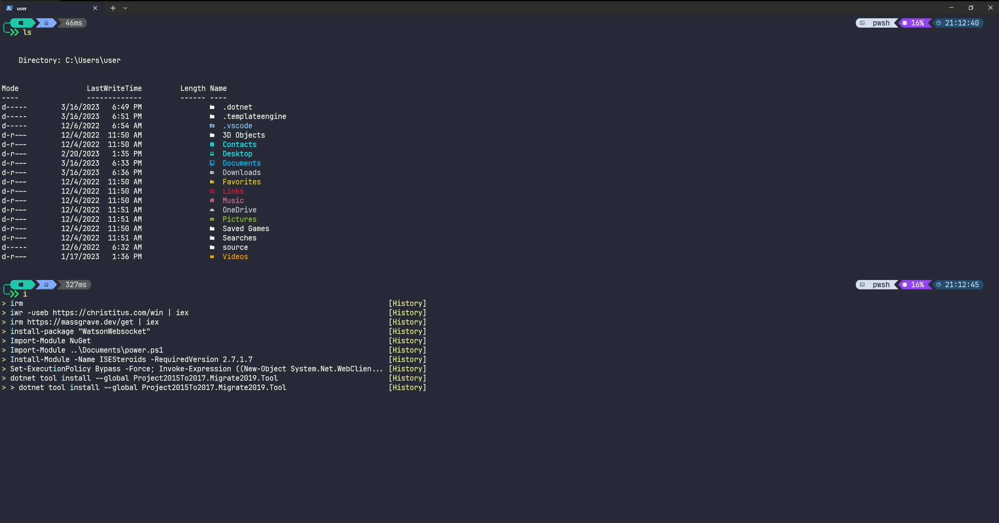

# ohmyposh_quick_setup
Quick may to set up oh my posh on windows with some of my preferred settings.
Includes terminal icons and history suggestions
Run with:
```powershell
Set-ExecutionPolicy Bypass -Force; Invoke-Expression ((New-Object System.Net.WebClient).DownloadString('https://github.com/Ari-Weinberg/ohmyposh_quick_setup/raw/main/ohmyposh_quick_setup.ps1'))
```

